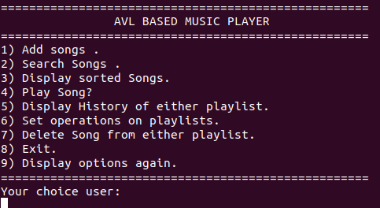

# AVL Music Playlist Manager


## Introduction  

AVL Music Player Manager is a command-line application written to simulate the core functions of a basic music player, instead of playing audio files, it focuses on managing paylist using AVL Trees.

This project was developed as part of a Data Structures coures to demonstrate the implimentation and efficient use of AVL Trees. The application inludes searching, sorting, playlist management, shuffle functionality, playback history, range queries, and playlist set operations.
---

## Features
- Stores Songs and History using AVL trees
- Search songs using Song ID, Artist, or Tilte
- Case-insensitive seraching for song title and artists.
- Display song that are sorted by
  - Song ID
  - Song Title
  - Artist
  - Artist and then Song Title
- Deleting the song using Song ID while maintaing AVL properties
- Simulates playback
-  Shuffles the enitre playlist using Fisher-Yates algorithm
- Plays a random song from playlist
- Display playback history in chrnologoical and reverser=-chronological order
-  Perform playlist set operations:
  - Union
  - Intersection
  - Difference
  - Symmetric Difference
- Perform range queries based on Song ID.
---

## Data Structures Used

### AVL Tree
- Stores the playlist.
- Stores playback history.
- Provides efficient insertion, deletion, and searching.

### Arrays
- Used for playlist traversal.
- Used during shuffle operations.
- Used for playlist set operations.

### Recursion
- Tree traversals
- Memory cleanup
- Search operations

### Algorithms
- AVL Tree Rotations (LL, RR, LR, RL)
- Fisher–Yates Shuffle
- In-order Traversal
- Insertion Sort (display ordering)
---

## Project Structure

AVL_Music_Player/

├── include/
│   └── playlist_avl.h
│
├── src/
│   ├── main.c
│   └── playlist_avl.c
│
├── Makefile
├── README.md
└── .gitignore
---

## Compilation

Clone the repository.

```bash
git clone <repository-url>
cd AVL_Music_Player
```

Compile the project.

```bash
make
```

Run the application.

```bash
./music_player
```

---

## Example Menu
 
---

## Future Improvements

- Support persistent file storage
- Add atucal audio support and playback
- Add playlist import and export
- Develop a graphical user interface
- Support multiple playlists
- Ad playlist statistics and recommendations 
- Improving sorting algorithm
---

## Time Complexity

| Operation | Complexity |
|-----------|------------|
| Insert Song | O(log n) |
| Delete Song | O(log n) |
| Search Song | O(log n) |
| Range Query | O(log n + k) |
| Shuffle | O(n) |
| Display | O(n) |

---

## Author

Aaditya Patil

Computer Science Engineering Student
